# BLE Stack 工程深度分析（bluetooth_stack）

## 目录

- [1. 工程定位与总体结论](#1-工程定位与总体结论)
- [2. 目录与职责分层](#2-目录与职责分层)
  - [2.1 关键目录职责](#21-关键目录职责)
  - [2.2 当前配置特征（以 `project/stm32f407_bb_bt/bt_config.h` 为准）](#22-当前配置特征以-projectstm32f407_bb_btbt_configh-为准)
- [3. 程序框架图（总体分层）](#3-程序框架图总体分层)
- [4. 启动时序图（上电到协议栈可用）](#4-启动时序图上电到协议栈可用)
- [5. 主循环软件流程图（STM32F407）](#5-主循环软件流程图stm32f407)
  - [5.1 主循环设计点评](#51-主循环设计点评)
- [6. HCI RX 数据路径（芯片 -> 协议栈 -> 应用）](#6-hci-rx-数据路径芯片---协议栈---应用)
- [7. HCI TX 命令路径（应用命令 -> 芯片）](#7-hci-tx-命令路径应用命令---芯片)
- [8. `phybusif_input` 解析状态机](#8-phybusif_input-解析状态机)
- [9. 协议栈内部链路（ACL到业务）](#9-协议栈内部链路acl到业务)
- [10. 命令控制流（JSON/AT 双入口）](#10-命令控制流jsonat-双入口)
- [11. Profile 初始化流程（`bt_stack_worked`）](#11-profile-初始化流程bt_stack_worked)
- [12. 多平台复用框架图（同栈多工程）](#12-多平台复用框架图同栈多工程)
- [13. 关键实现特征与工程建议](#13-关键实现特征与工程建议)
  - [13.1 实现特征](#131-实现特征)
  - [13.2 可优化点（架构层）](#132-可优化点架构层)
- [14. 关键路径索引（便于二次追踪）](#14-关键路径索引便于二次追踪)
- [15. Profile 级详细流程图（SPP / A2DP / BLE）](#15-profile-级详细流程图spp--a2dp--ble)
  - [15.1 SPP：连接建立 + 数据收发时序](#151-spp连接建立--数据收发时序)
  - [15.2 A2DP Sink：信令连接 + 流媒体建立 + 播放事件](#152-a2dp-sink信令连接--流媒体建立--播放事件)
  - [15.3 BLE：扫描 + 广播 + GATT/BAS 典型流程](#153-ble扫描--广播--gattbas-典型流程)
- [16. OPERATE 到函数映射表（主命令通道）](#16-operate-到函数映射表主命令通道)
  - [16.1 公共控制命令](#161-公共控制命令)
  - [16.2 BLE 命令](#162-ble-命令)
  - [16.3 SPP 命令](#163-spp-命令)
  - [16.4 HFP 命令（若开启）](#164-hfp-命令若开启)
  - [16.5 AVRCP 命令（若开启）](#165-avrcp-命令若开启)
  - [16.6 HID 命令（若开启）](#166-hid-命令若开启)
  - [16.7 PBAP 命令（若开启）](#167-pbap-命令若开启)
- [17. GAP / GATT / L2CAP 专章](#17-gap--gatt--l2cap-专章)
  - [17.1 L2CAP（含 BLE 固定信道）](#171-l2cap含-ble-固定信道)
  - [17.2 GAP（通过 GATT Server 暴露）](#172-gap通过-gatt-server-暴露)
  - [17.3 GATT（客户端/服务端双角色）](#173-gatt客户端服务端双角色)
  - [17.4 三者关系总结](#174-三者关系总结)
- [18. SMP 层深度分析](#18-smp-层深度分析)
  - [18.1 SMP 在本工程中的定位](#181-smp-在本工程中的定位)
  - [18.2 初始化与接入路径](#182-初始化与接入路径)
  - [18.3 数据入口与 opcode 分发](#183-数据入口与-opcode-分发)
  - [18.4 配对方法选择逻辑（Legacy vs Secure Connections）](#184-配对方法选择逻辑legacy-vs-secure-connections)
  - [18.5 Legacy Pairing 主流程](#185-legacy-pairing-主流程)
  - [18.6 Secure Connections (SC) 主流程](#186-secure-connections-sc-主流程)
  - [18.7 密钥管理与重连行为](#187-密钥管理与重连行为)
  - [18.8 当前实现边界与建议](#188-当前实现边界与建议)
  - [18.9 Secure Connections 实现级细化](#189-secure-connections-实现级细化)
  - [18.10 SC 报文字段级对照表（PDU 字节位 + 工程读写位置）](#1810-sc-报文字段级对照表pdu-字节位--工程读写位置)
- [19. GAP / GATT Service 深度分析](#19-gap--gatt-service-深度分析)
  - [19.1 架构定位：GAP Service 与 GATT Service 的关系](#191-架构定位gap-service-与-gatt-service-的关系)
  - [19.2 GAP Service 静态定义（`bt_gatt.c`）](#192-gap-service-静态定义bt_gattc)
  - [19.3 GATT Service 静态定义（`bt_gatt.c`）](#193-gatt-service-静态定义bt_gattc)
  - [19.4 服务注册机制（核心）](#194-服务注册机制核心)
  - [19.5 ATT 请求到 Service 的命中路径](#195-att-请求到-service-的命中路径)
  - [19.6 GAP Device Name 读流程（最常见实链路）](#196-gap-device-name-读流程最常见实链路)
  - [19.7 服务发现流程（GATT Client 角度）](#197-服务发现流程gatt-client-角度)
  - [19.8 BAS 作为可插拔 Service 模板](#198-bas-作为可插拔-service-模板)
  - [19.9 GAP/GATT Service 字段与句柄总表（当前默认）](#199-gapgatt-service-字段与句柄总表当前默认)
  - [19.10 当前实现边界与改进建议（GAP/GATT Service）](#1910-当前实现边界与改进建议gapgatt-service)
  - [19.11 GAP/GATT 抓包字段对照表（Wireshark <-> 本工程函数/偏移）](#1911-gapgatt-抓包字段对照表wireshark----本工程函数偏移)
- [20. 程序调用实现（Mermaid 图示）](#20-程序调用实现mermaid-图示)
  - [20.1 总调用链（启动 + 主循环 + 协议栈）](#201-总调用链启动--主循环--协议栈)
  - [20.2 收包调用链（H4 -> HCI -> L2CAP -> ATT/GATT）](#202-收包调用链h4---hci---l2cap---attgatt)
  - [20.3 固定信道回调注册机制（调用是如何“接上”的）](#203-固定信道回调注册机制调用是如何接上的)
  - [20.4 命令调用链（应用命令 -> Wrapper -> 协议 API）](#204-命令调用链应用命令---wrapper---协议-api)
  - [20.5 单次 GAP Device Name 读取（`0x2A00`）](#205-单次-gap-device-name-读取0x2a00)

## 1. 工程定位与总体结论

这个工程是一个**跨平台（Linux/Windows/多款 STM32）复用同一套蓝牙协议栈核心代码**的实现。
核心思想是：

- 上层应用与命令接口统一（`project/*/main.c` + `bt_wrapper`）
- 协议栈核心统一（`component/bluetooth/src/core`）
- 物理传输可替换（`bt_phybusif_h4.c`：UART H4）
- 板级驱动按平台替换（`board/*` + `bsp/*`）

在 `stm32f407_bb_bt` 目标工程下，主流程是：

1. 板级初始化 + UART 调试口初始化
2. 主循环中持续调用 `phybusif_input(&uart_if)` 吸收 HCI 数据
3. 周期执行 `l2cap_tmr()` / `rfcomm_tmr()` 驱动协议栈定时状态机
4. 蓝牙控制命令来自调试串口 JSON/AT 文本，由 `shell_parse` 分发到 `bt_wrapper` API

---

## 2. 目录与职责分层

### 2.1 关键目录职责

- `project/stm32f407_bb_bt/`
  - 应用入口与业务命令分发
  - 平台专用 H4 传输层实现（UART2 + DMA + RingBuffer）
- `component/bluetooth/wrapper/`
  - 统一 API（`bt_start`, `bt_start_inquiry`, `bt_le_*` 等）
  - 将 core 层事件转发为 app 回调
- `component/bluetooth/src/core/`
  - 核心协议：HCI/L2CAP/RFCOMM/SDP/SPP/A2DP/GATT/SMP...
- `board/stm32f407/` + `bsp/cortex-m4/`
  - HAL/外设驱动与中断适配（UART、SysTick、LED、LCD 等）

### 2.2 当前配置特征（以 `project/stm32f407_bb_bt/bt_config.h` 为准）

- 经典蓝牙：开启
- BLE：开启
- 传输：H4（`BT_TRANSPORT_TYPE 0x02`）
- Vendor：CSR8X11 开启
- Profile：
  - DID：开启
  - SPP：开启
  - A2DP Sink：开启
  - BAS（BLE Battery Service）：开启
  - HFP/AVRCP/HID/PBAP：默认关闭（可通过宏重新开启）

---

## 3. 程序框架图（总体分层）

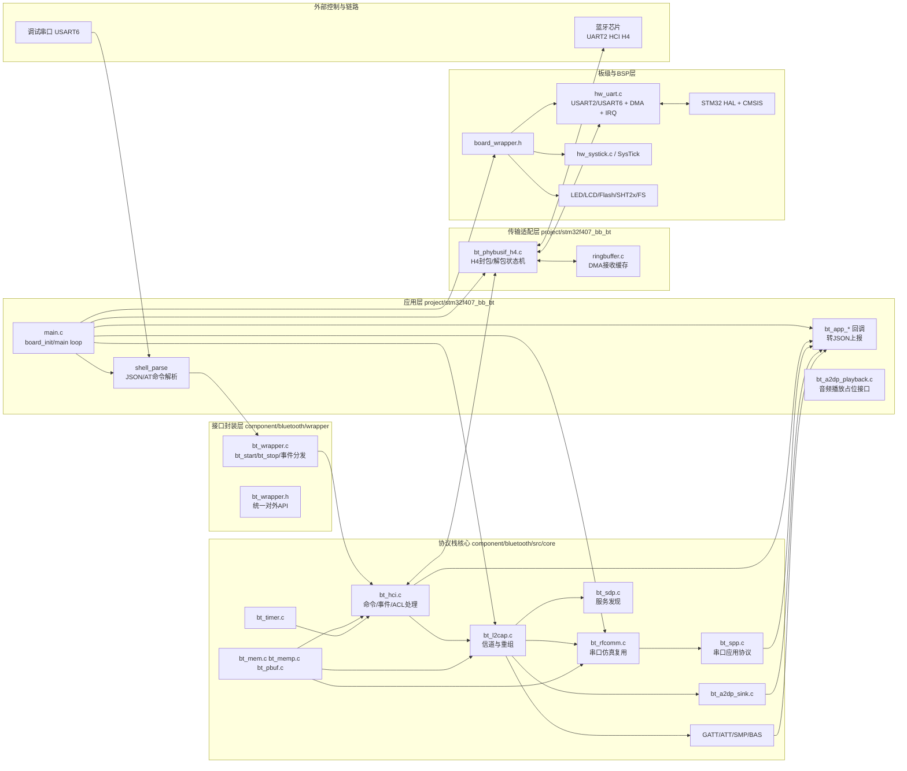

---

## 4. 启动时序图（上电到协议栈可用）

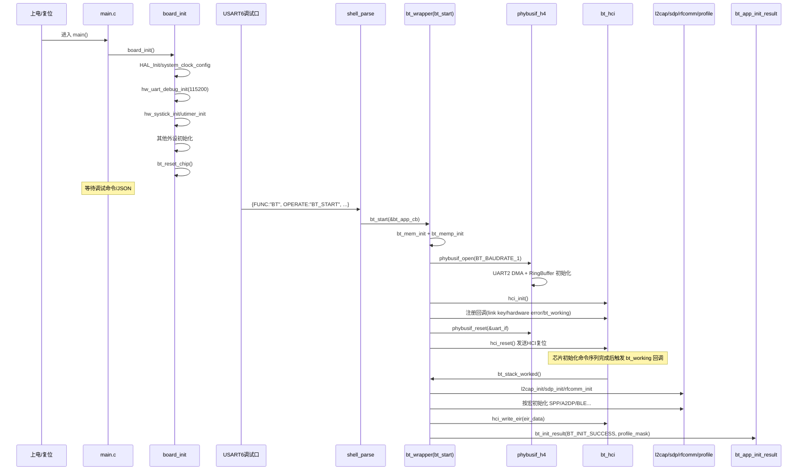

---

## 5. 主循环软件流程图（STM32F407）

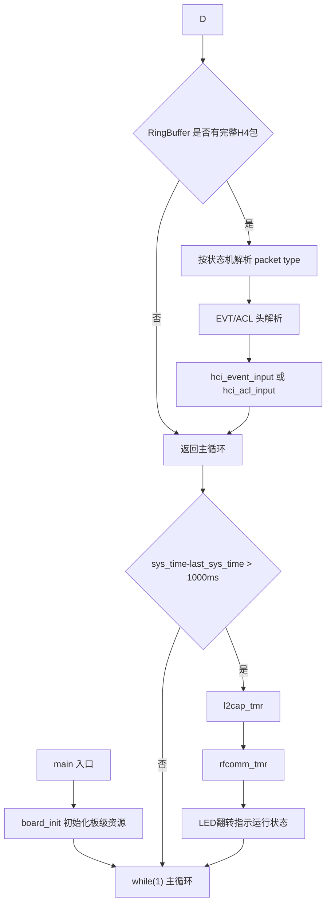

### 5.1 主循环设计点评

- `phybusif_input` 放在主循环高频执行，确保 UART-DMA 缓冲被持续消费。
- L2CAP/RFCOMM 定时器以 1 秒周期调度，负责超时重传与状态机推进。
- 没有 RTOS 任务切分，采用“前台循环 + 中断喂数据”的轻量架构。

---

## 6. HCI RX 数据路径（芯片 -> 协议栈 -> 应用）

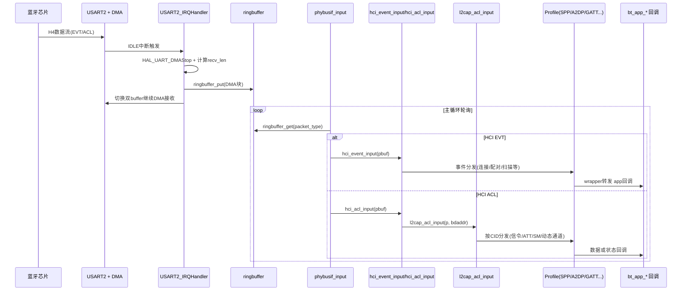

---

## 7. HCI TX 命令路径（应用命令 -> 芯片）

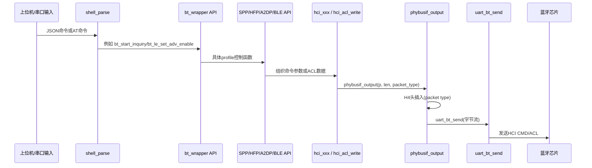

---

## 8. `phybusif_input` 解析状态机

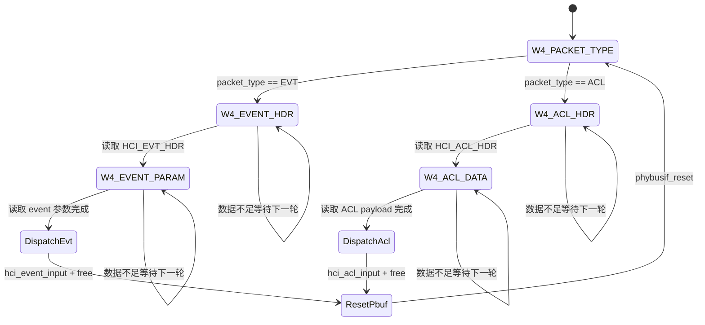

---

## 9. 协议栈内部链路（ACL到业务）

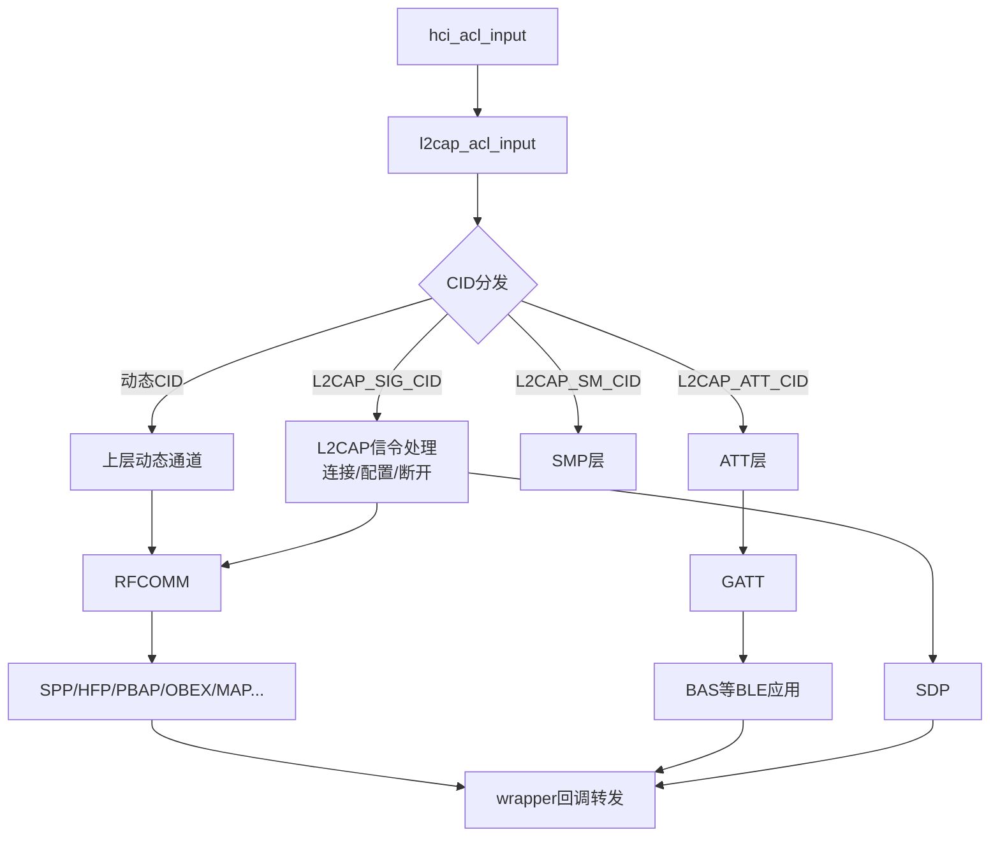

---

## 10. 命令控制流（JSON/AT 双入口）

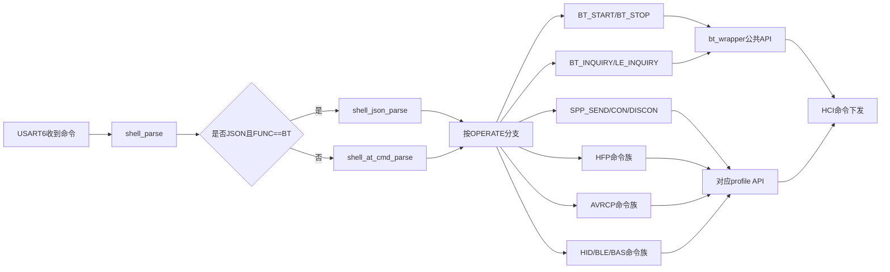

---

## 11. Profile 初始化流程（`bt_stack_worked`）

```mermaid
flowchart TD
    A[bt_stack_worked 回调触发] --> B[l2cap_init]
    B --> C[sdp_init]
    C --> D[rfcomm_init]

    D --> E{PROFILE_DID_ENABLE}
    E -- yes --> E1[did_init + mask]
    E -- no --> F

    E1 --> F{PROFILE_SPP_ENABLE}
    F -- yes --> F1[spp_init + mask]
    F -- no --> G

    F1 --> G{PROFILE_HFP_HF_ENABLE}
    G -- yes --> G1[hfp_hf_init + mask]
    G -- no --> H

    G1 --> H{PROFILE_PBAP_ENABLE}
    H -- yes --> H1[pbap_client_init + mask]
    H -- no --> I

    H1 --> I{PROFILE_A2DP_ENABLE}
    I -- yes --> I1[a2dp_sink_init + mask]
    I -- no --> J

    I1 --> J{PROFILE_AVRCP_ENABLE}
    J -- yes --> J1[avrcp_controller_init + mask]
    J -- no --> K

    J1 --> K{PROFILE_HID_ENABLE}
    K -- yes --> K1[hid_device_init + sdp + mask]
    K -- no --> L

    K1 --> L{BT_BLE_ENABLE}
    L -- yes --> L1[gatt_init + smp_init + gatt_server_init]
    L -- no --> M

    L1 --> L2{PROFILE_BAS_ENABLE}
    L2 -- yes --> L3[bas_init]
    L2 -- no --> M

    L3 --> M[hci_write_eir]
    M --> N[bt_init_result 回调通知应用]
```

---

## 12. 多平台复用框架图（同栈多工程）

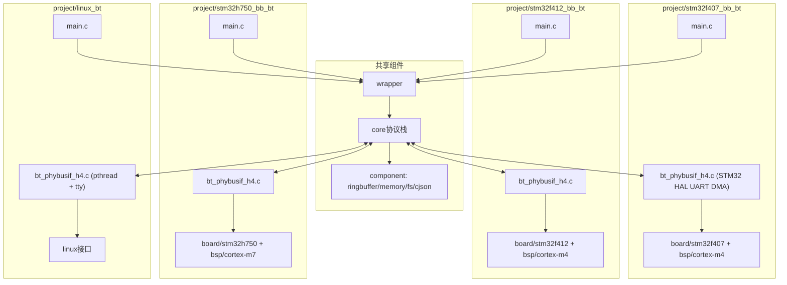

---

## 13. 关键实现特征与工程建议

### 13.1 实现特征

- 采用 DMA + IDLE 中断 + RingBuffer 的串口接收架构，适合 H4 流式输入。
- `phybusif_input` 在主循环轮询解析，逻辑简单且可移植。
- `wrapper` 将 profile 回调统一成 app callback 结构体，业务侧接入成本低。
- 通过 `bt_config.h` 宏裁剪 profile，构建可按功能缩放。

### 13.2 可优化点（架构层）

- `main.c` 命令解析逻辑较长，建议拆分命令表驱动（命令->handler）降低维护成本。
- `shell_parse` 中 JSON 字段未做空指针健壮性检查，建议增强异常输入保护。
- 可增加“任务节拍图”或 RTOS 化改造，避免 profile 增加后主循环压力上升。
- `bt_a2dp_playback.c` 当前为占位实现，可接入 I2S/DMA 真正音频输出链路。

---

## 14. 关键路径索引（便于二次追踪）

- 启动入口：`project/stm32f407_bb_bt/main.c`
- 板级初始化：`board_init`（同文件）
- 命令解析：`shell_parse / shell_json_parse / shell_at_cmd_parse`（同文件）
- 栈启动：`component/bluetooth/wrapper/bt_wrapper.c` -> `bt_start`
- 栈ready回调：`bt_stack_worked`
- 传输输入状态机：`project/stm32f407_bb_bt/bt_phybusif_h4.c` -> `phybusif_input`
- HCI事件处理：`component/bluetooth/src/core/bt_hci.c` -> `hci_event_input`
- HCI ACL处理：`component/bluetooth/src/core/bt_hci.c` -> `hci_acl_input`
- L2CAP输入分发：`component/bluetooth/src/core/bt_l2cap.c` -> `l2cap_acl_input`
- RFCOMM定时：`component/bluetooth/src/core/classical/bt_rfcomm.c` -> `rfcomm_tmr`
- SPP数据上报：`component/bluetooth/src/core/classical/bt_spp.c` -> `spp_recv_data`

---

以上分析与图均基于当前仓库代码路径和 `stm32f407_bb_bt` 工程配置。

---

## 15. Profile 级详细流程图（SPP / A2DP / BLE）

### 15.1 SPP：连接建立 + 数据收发时序

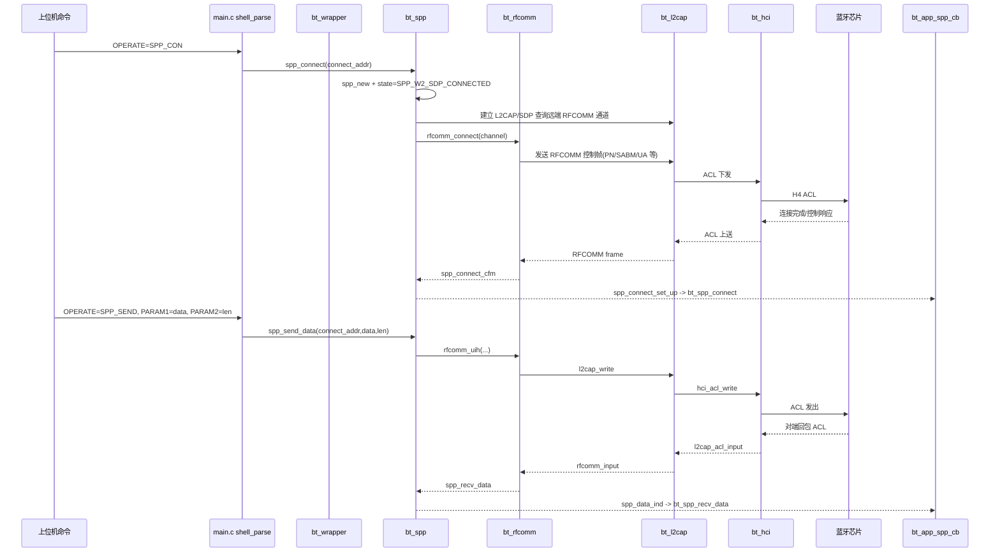

### 15.2 A2DP Sink：信令连接 + 流媒体建立 + 播放事件

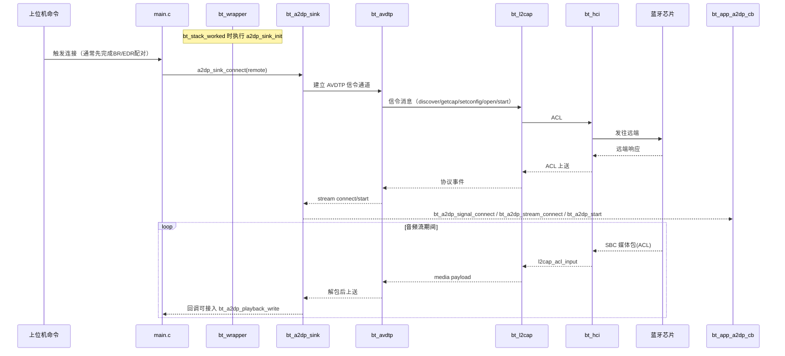

### 15.3 BLE：扫描 + 广播 + GATT/BAS 典型流程

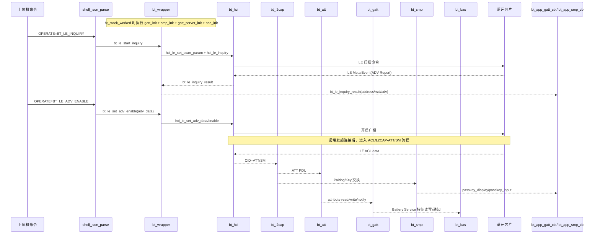

---

## 16. OPERATE 到函数映射表（主命令通道）

说明：

- 下表以 `project/stm32f407_bb_bt/main.c` 中 `shell_json_parse` / `shell_at_cmd_parse` 为基准。
- 命令是否可用受 `bt_config.h` 的宏控制（例如 `PROFILE_SPP_ENABLE`、`PROFILE_A2DP_ENABLE`、`BT_BLE_ENABLE`）。

### 16.1 公共控制命令

| OPERATE / 命令 | 入口解析函数 | 调用函数 | 所属层 | 作用 |
|---|---|---|---|---|
| `BT_START` | shell_json_parse / shell_at_cmd_parse | `bt_start(&bt_app_cb)` | wrapper | 启动协议栈 |
| `BT_STOP` | shell_json_parse / shell_at_cmd_parse | `bt_stop()` | wrapper | 停止协议栈 |
| `BT_INQUIRY` | shell_json_parse / shell_at_cmd_parse | `bt_start_inquiry(0x30, HCI_INQUIRY_MAX_DEV)` | wrapper/HCI | 经典蓝牙搜索 |
| `BT_CANCEL_INQUIRY` | shell_json_parse / shell_at_cmd_parse | `bt_stop_inquiry()` | wrapper/HCI | 取消经典搜索 |

### 16.2 BLE 命令

| OPERATE / 命令 | 入口解析函数 | 调用函数 | 所属层 | 作用 |
|---|---|---|---|---|
| `BT_LE_INQUIRY` | shell_at_cmd_parse | `bt_le_start_inquiry()` | wrapper/HCI | 开始 BLE 扫描 |
| `BT_LE_STOP_INQUIRY` | shell_at_cmd_parse | `bt_le_stop_inquiry()` | wrapper/HCI | 停止 BLE 扫描 |
| `BT_LE_ADV_ENABLE` | shell_at_cmd_parse | `bt_le_set_adv_enable(adv_data_len, adv_data)` | wrapper/HCI | 开启广播 |
| `BT_LE_ADV_DISABLE` | shell_at_cmd_parse | `bt_le_set_adv_disable()` | wrapper/HCI | 关闭广播 |
| `BAS_LEVEL_UPDATE` | shell_at_cmd_parse | `bas_batt_level_notification(...)` | BAS/GATT | 发送电量通知 |

### 16.3 SPP 命令

| OPERATE / 命令 | 入口解析函数 | 调用函数 | 所属层 | 作用 |
|---|---|---|---|---|
| `SPP_CON` | shell_at_cmd_parse | `spp_connect(&connect_addr)` | SPP/RFCOMM | 建立 SPP 连接 |
| `SPP_SEND` | shell_json_parse / shell_at_cmd_parse | `spp_send_data(&connect_addr, data, len)` | SPP/RFCOMM | 发送 SPP 数据 |
| `SPP_DISCON` | shell_at_cmd_parse | `spp_disconnect(&connect_addr)` | SPP/RFCOMM | 断开 SPP |

### 16.4 HFP 命令（若开启）

| OPERATE / 命令 | 入口解析函数 | 调用函数 | 作用 |
|---|---|---|---|
| `HFP_CON` | shell_at_cmd_parse | `hfp_hf_connect(&connect_addr)` | 建立 HFP HF 连接 |
| `HFP_DISCON` | shell_at_cmd_parse | `hfp_hf_disconnect(&connect_addr)` | 断开 HFP |
| `BT_AUDIO_TRANSFER` | 两者 | `bt_hfp_hf_audio_transfer(&connect_addr)` | 音频链路切换 |
| `HFP_ANSWER` | 两者 | `bt_hfp_hf_accept_incoming_call(&connect_addr)` | 接听电话 |
| `HFP_CALLEND` | 两者 | `bt_hfp_hf_end_call(&connect_addr)` | 挂断电话 |
| `HFP_CALLOUT_PN` | 两者 | `bt_hfp_hf_callout_by_number(&connect_addr, para1)` | 指定号码呼出 |
| `HFP_CALLOUT_MEM` | shell_at_cmd_parse | `bt_hfp_hf_callout_by_memory(&connect_addr, 1)` | 存储号码呼出 |
| `HFP_CALLOUT_LC` | shell_at_cmd_parse | `bt_hfp_hf_callout_by_last(&connect_addr)` | 最近号码呼出 |
| `HFP_LPN` | 两者 | `bt_hfp_hf_get_local_phone_number(&connect_addr)` | 查询本机号 |
| `HFP_CLCC` | 两者 | `bt_hfp_hf_get_call_list(&connect_addr)` | 查询通话列表 |
| `HFP_NRECD` | shell_at_cmd_parse | `bt_hfp_hf_disable_ecnr(&connect_addr)` | 关闭 ECNR |
| `HFP_VGM` | 两者 | `bt_hfp_hf_set_mic_volume(&connect_addr, value)` | 设置麦克风音量 |
| `HFP_VGS` | 两者 | `bt_hfp_hf_set_spk_volume(&connect_addr, value)` | 设置扬声器音量 |
| `HFP_DTMF` | 两者 | `bt_hfp_hf_transmit_dtmf(&connect_addr, value)` | 发送 DTMF |
| `HFP_VGE` | 两者 | `bt_hfp_hf_set_voice_recognition(&connect_addr, 1)` | 开启语音识别 |
| `HFP_VGD` | 两者 | `bt_hfp_hf_set_voice_recognition(&connect_addr, 0)` | 关闭语音识别 |
| `HFP_CGMI` | 两者 | `bt_hfp_hf_get_manufacturer_id(&connect_addr)` | 查询厂商信息 |
| `HFP_CGMM` | 两者 | `bt_hfp_hf_get_model_id(&connect_addr)` | 查询型号信息 |
| `HFP_CGMR` | shell_at_cmd_parse | `bt_hfp_hf_get_revision_id(&connect_addr)` | 查询版本信息 |
| `HFP_PID` | shell_at_cmd_parse | `bt_hfp_hf_get_pid(&connect_addr)` | 查询产品ID |

### 16.5 AVRCP 命令（若开启）

| OPERATE / 命令 | 入口解析函数 | 调用函数 | 作用 |
|---|---|---|---|
| `AVRCP_LIST_APP_ATTR` | 两者 | `bt_avrcp_controller_list_app_setting_attr(&connect_addr)` | 查询应用设置能力 |
| `AVRCP_PLAY_STATUS` | shell_at_cmd_parse | `bt_avrcp_controller_get_play_status(&connect_addr)` | 查询播放状态 |
| `AVRCP_GET_ID3` | 两者 | `bt_avrcp_controller_get_element_attributes(&connect_addr)` | 查询歌曲元数据 |
| `AVRCP_PLAY` | 两者 | `bt_avrcp_controller_control(..., AVRCP_CONTROL_ID_PLAY)` | 播放 |
| `AVRCP_PAUSE` | 两者 | `bt_avrcp_controller_control(..., AVRCP_CONTROL_ID_PAUSE)` | 暂停 |
| `AVRCP_PREV` | 两者 | `bt_avrcp_controller_control(..., AVRCP_CONTROL_ID_BACKWARD)` | 上一曲 |
| `AVRCP_NEXT` | 两者 | `bt_avrcp_controller_control(..., AVRCP_CONTROL_ID_FORWARD)` | 下一曲 |
| `AVRCP_FAST_BACKWARD` | 两者 | `bt_avrcp_controller_control(..., AVRCP_CONTROL_ID_FAST_BACKWARD)` | 快退 |
| `AVRCP_FAST_FORWARD` | 两者 | `bt_avrcp_controller_control(..., AVRCP_CONTROL_ID_FAST_FORWARD)` | 快进 |

### 16.6 HID 命令（若开启）

| OPERATE / 命令 | 入口解析函数 | 调用函数 | 作用 |
|---|---|---|---|
| `HID_MOUSE_L/R/U/D` | 两者 | `bt_hid_interupt_report(&connect_addr, report, sizeof(report))` | 鼠标移动 |
| `HID_MOUSE_CLICKL_DOWN/UP` | 两者 | `bt_hid_interupt_report(...)` | 左键按下/释放 |
| `HID_MOUSE_CLICKR_DOWN/UP` | 两者 | `bt_hid_interupt_report(...)` | 右键按下/释放 |
| `HID_KEYBOARD_INPUT` | shell_json_parse | `bt_hid_find_keycode` + `bt_hid_interupt_report(...)` | 键盘输入 |

### 16.7 PBAP 命令（若开启）

| OPERATE / 命令 | 入口解析函数 | 调用函数 | 作用 |
|---|---|---|---|
| `PBAP_CON` | shell_at_cmd_parse | `bt_pbap_client_connect(&connect_addr)` | 建立 PBAP |
| `PBAP_DISCON` | shell_at_cmd_parse | `bt_pbap_client_disconnect(&connect_addr)` | 断开 PBAP |
| `PBAP_LP/LI/LO/LM/LC` | shell_at_cmd_parse | `bt_pbap_client_download_phonebook(...)` | 下载不同电话簿 |
| `PBAP_QUEQY_*` | shell_at_cmd_parse | `bt_pbap_client_query_phonebook_size(...)` | 查询电话簿大小 |
| `PBAP_SPL/SPC` | shell_at_cmd_parse | `bt_pbap_client_set_path(...)` | 切换路径 |
| `PBAP_DVL/DVC` | shell_at_cmd_parse | `bt_pbap_client_download_vcard_list(...)` | 下载名片列表 |
| `PBAP_DVE` | shell_at_cmd_parse | `bt_pbap_client_download_vcard_entry(...)` | 下载名片条目 |
| `PBAP_ABORT` | shell_at_cmd_parse | `bt_pbap_client_download_abort(&connect_addr)` | 中止下载 |

---

## 17. GAP / GATT / L2CAP 专章

你提到的三块在工程里都存在，而且是 BLE 路径的核心：

- L2CAP：负责 CID 分发、分片重组、固定信道 ATT/SM 转发
- GAP：通过 GATT Server 的 GAP Service 暴露设备名等基础属性
- GATT：基于 ATT 的属性协议实现，承载服务发现、读写、通知

### 17.1 L2CAP（含 BLE 固定信道）

关键实现点：

- `l2cap_acl_input` 根据 `cid` 分发
  - `L2CAP_ATT_CID` -> `_l2cap_fixed_cid_process`
  - `L2CAP_SM_CID` -> `_l2cap_fixed_cid_process`
  - 经典信令与动态通道分别走独立分支
- ATT 与 SMP 在各自模块注册固定信道接收处理

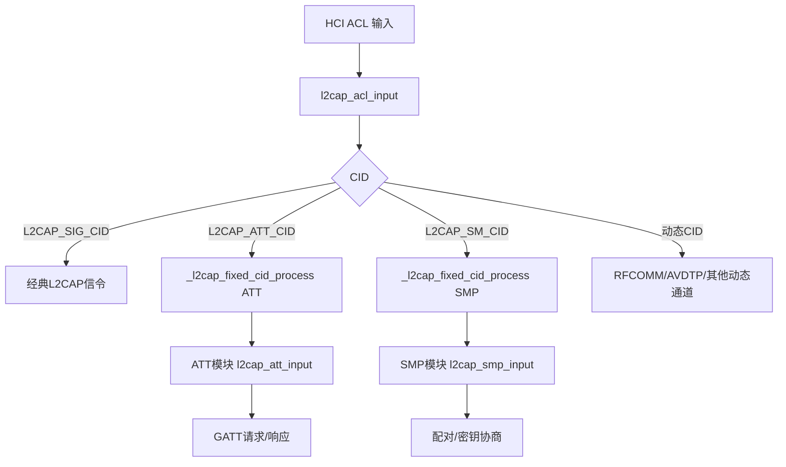

### 17.2 GAP（通过 GATT Server 暴露）

关键实现点：

- 在 `bt_gatt.c` 中定义 `gap_service[]`
- GAP 服务句柄由配置宏给出：
  - `GATT_GAP_SERVICE_HANDLE`
  - `GATT_GAP_CHARACTERISTIC_HANDLE`
  - `GATT_GAP_NAME_HANDLE`
  - `GATT_GAP_NAME`（默认等于 `BT_LOCAL_NAME`）
- `gatt_server_init` 时将 GAP Service 注册到 GATT Server

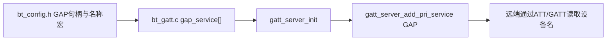

### 17.3 GATT（客户端/服务端双角色）

关键实现点：

- 初始化入口：`gatt_init` -> `att_init(&att_gatt_cb)`
- 服务端入口：`gatt_server_init`（先注册 GAP，再注册 GATT Service，再可叠加 BAS 等）
- 数据入口：`att_gatt_data_recv` 按 ATT opcode 分发
  - 例如 MTU、Read/Write、Find Info、Notify/Indicate 等

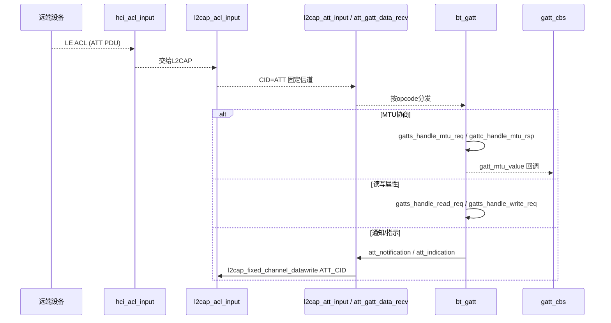

### 17.4 三者关系总结

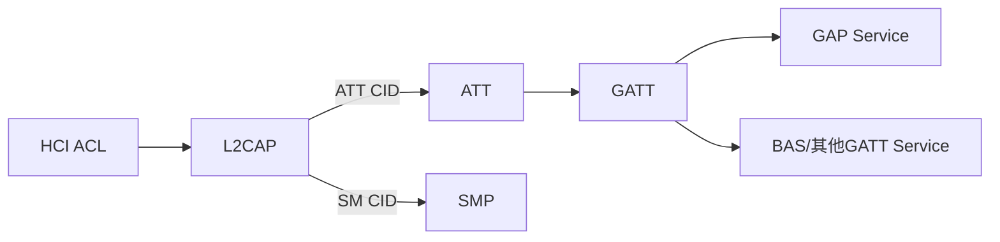

---

## 18. SMP 层深度分析

你说得非常准确，SMP 之前只在 L2CAP/GATT 图里被提到，没有单独展开。下面是按当前工程真实代码补充的完整分析。

### 18.1 SMP 在本工程中的定位

- 协议角色：BLE 安全管理（配对、认证、密钥分发、重连加密）
- 通道位置：L2CAP 固定信道 `L2CAP_SM_CID`
- 主要源码：
  - `component/bluetooth/src/core/ble/bt_smp.c`
  - `component/bluetooth/src/core/ble/bt_smp_key.c`
  - `component/bluetooth/src/include/ble/bt_smp.h`

### 18.2 初始化与接入路径

核心初始化发生在 `bt_stack_worked` 中调用 `smp_init(&smp_wrapper_cb)` 之后。

`smp_init` 做了 4 件关键事：

1. 保存上层回调 `smp_cbs`
2. 注册 HCI 安全相关回调
   - `hci_register_ltk_req(smp_ltk_request_handle)`
   - `hci_register_enc_change(smp_enc_change_handle)`
   - `hci_register_public_key(smp_local_p256_public_key_handle)`
   - `hci_register_dhkey_complete(smp_dhkey_complete_handle)`
3. 向 L2CAP 注册固定信道接收
   - `l2cap_fixed_channel_register_recv(L2CAP_SM_CID, l2cap_smp_connect, l2cap_smp_disconnect, l2cap_smp_input)`
4. 使 SMP 能在连接生命周期中创建/销毁 `smp_pcb_t`

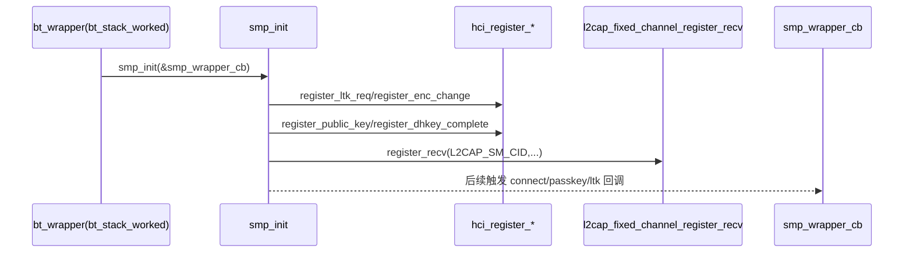

### 18.3 数据入口与 opcode 分发

SMP 数据入口：`l2cap_smp_input`。

当前明确处理的 opcode：

- `SMP_OPCODE_PAIRING_REQ` -> `smp_handle_pairing_req`
- `SMP_OPCODE_CONFIRM` -> `smp_handle_pairing_confirm`
- `SMP_OPCODE_RAND` -> `smp_handle_pairing_random`
- `SMP_OPCODE_PAIR_PUBLIC_KEY` -> `smp_handle_pairing_public_key`
- `SMP_OPCODE_PAIR_DHKEY_CHECK` -> `smp_handle_dhkey_check`

说明：像 `PAIRING_RSP / ENCRYPT_INFO / MASTER_ID / IDENTITY_INFO / ID_ADDR` 在输入分发里当前未展开处理（case 存在但为空），本实现更偏向“本端发 key distribution + 对端侧核心配对处理”。

### 18.4 配对方法选择逻辑（Legacy vs Secure Connections）

方法选择函数：`smp_select_pairing_method`。

判定要点：

- 若双方 `AuthReq` 都含 `SMP_SC_SUPPORT_BIT`，则 `use_sc=1` 走 Secure Connections
- 否则走 Legacy
- 在 SC 或 Legacy 各自路径下，再依据：
  - IO 能力（display/keyboard/noio 等）
  - OOB 标志
  - MITM 位
  - 连接角色（master/slave）
  使用二维表 `smp_sc_pair_table` / `smp_legacy_pair_table` 决策

可选模型包括：

- Legacy：Just Works / Passkey Input / Passkey Display / OOB
- SC：Just Works / Numeric Comparison / Passkey Entry / OOB

### 18.5 Legacy Pairing 主流程

1. 收到 `Pairing Request`，记录对端能力并构造本端响应
2. 发送 `Pairing Response`
3. 收到对端 `Confirm` 后，按模型准备 TK（0、输入、显示）
4. 用 `smp_c1` 计算本端 confirm 并发送
5. 收到对端 `Random` 后再用 `smp_c1` 校验对端 confirm
6. 校验通过后发送本端 random
7. 用 `smp_s1` 生成 STK，随后链路加密
8. 加密变化回调中执行 `smp_distribution_key`，分发 LTK/IRK/Identity Address 等

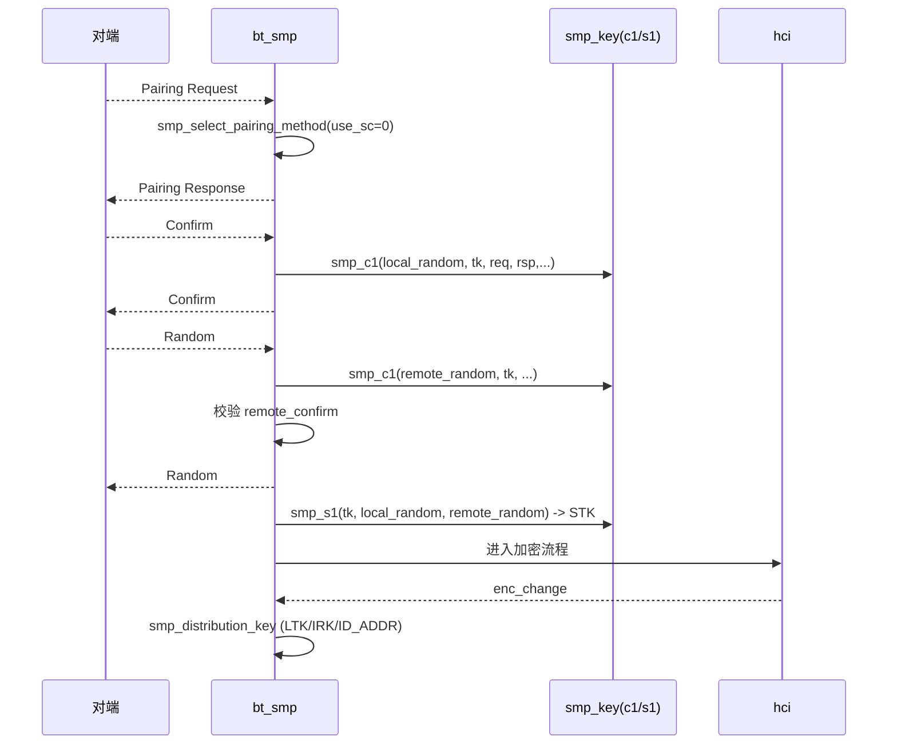

### 18.6 Secure Connections (SC) 主流程

1. 双方交换 P-256 Public Key（`SMP_OPCODE_PAIR_PUBLIC_KEY`）
2. 本端触发 `hci_le_generate_dhkey`
3. HCI 回调 `smp_dhkey_complete_handle` 保存本端 DHKey
4. 通过 `f5` 派生 `MacKey` 与 `LTK`
5. 通过 `f6` 计算并校验 `DHKey Check`
6. 校验通过后发送本端 `DHKey Check`
7. 后续链路加密完成后进行 key distribution 收尾

本实现中使用的关键函数（`bt_smp_key.c`）：

- `smp_f4`：SC confirm 相关
- `smp_g2`：passkey/numeric comparison 相关
- `smp_f5`：从 DHKey 派生 MacKey/LTK
- `smp_f6`：DHKey Check

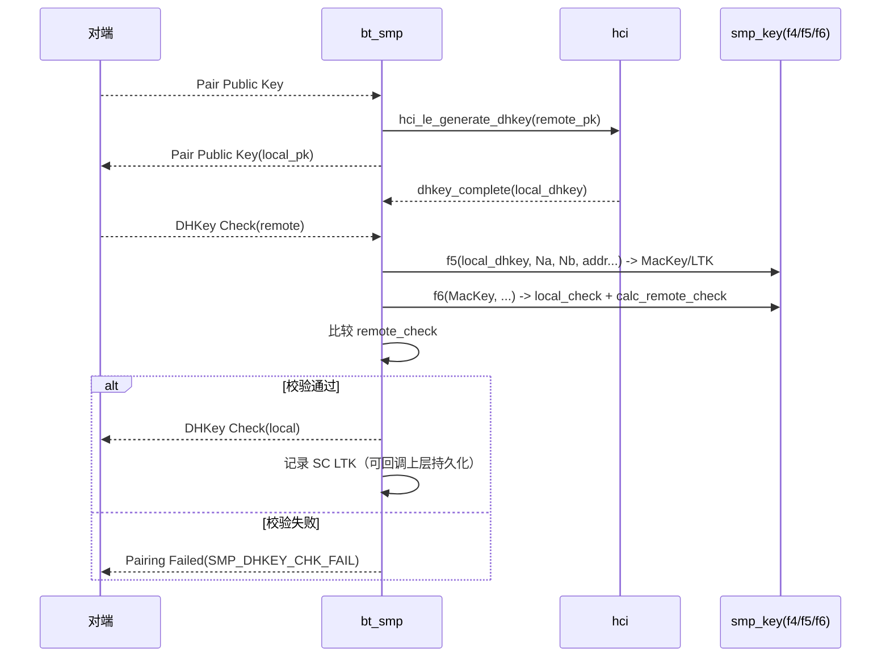

### 18.7 密钥管理与重连行为

关键点：

- 配对过程中：
  - Legacy 使用 `stk`（短期）与后续 `ltk`
  - SC 直接派生 `sc_ltk`
- 持久化接口（经 wrapper 透传到应用）：
  - `smp_ltk_generate(device_info)`：生成后上报保存
  - `smp_ltk_request(device_info, has_device)`：重连时查询历史 LTK
- 重连加密入口：`smp_ltk_request_handle`
  - 正在配对：用当前会话 STK/SC LTK 回复
  - 非配对场景：从上层持久化记录中取 LTK 回复

这也是 `bt_wrapper.c` 中 `le_device_instance` 的作用：示例化保存最近设备的 LTK 与 `is_sc`。

### 18.8 当前实现边界与建议

- 优点：
  - Legacy + SC 双栈路径均已打通
  - HCI/L2CAP/Wrapper 回调链完整
  - 已提供 LTK 持久化钩子，便于量产改造
- 边界：
  - `l2cap_smp_input` 中部分 opcode 处理尚空实现（例如一些对端分发键回包处理）
  - passkey 与随机数目前直接依赖 `rand()`，安全强度建议替换为硬件 TRNG
  - 单设备示例缓存（`le_device_instance`）可扩展为多设备绑定表

### 18.9 Secure Connections 实现级细化

这一节专门回答“SC 具体是怎么在这份代码里跑起来的”，重点放在函数、字段、时序、失败分支。

#### 18.9.1 关键状态字段（`smp_pcb_t`）

SC 过程中真正会用到的成员：

- 公钥与 DHKey：
  - `local_sc_public_key[64]`
  - `remote_sc_public_key[64]`
  - `sc_local_dhkey[32]`
- 随机数与比较值：
  - `sc_na[16]`（对端 random）
  - `sc_nb[16]`（本端 random）
  - `sc_vb`（`g2` 结果，数值比较场景）
- 会话密钥材料：
  - `sc_mackey[16]`
  - `sc_ltk[16]`
  - `remote_dhkey_check[16]`
- 过程控制：
  - `use_sc`
  - `pairing_method`
  - `flag & SMP_FLAG_PAIRING`

这些字段是 SC 与 Legacy 并行共存的核心；`use_sc=1` 后，同一连接上的后续确认/随机流程都会切到 SC 语义。

#### 18.9.2 SC 启用判定（协商门槛）

代码在 `smp_select_pairing_method` 里先做总开关判定：

- 条件：
  - `remote_auth_req & SMP_SC_SUPPORT_BIT`
  - `local_auth_req  & SMP_SC_SUPPORT_BIT`
- 同时满足才置 `use_sc = 1`

本地 `AuthReq` 来自 `smp_ass_authreq`，其逻辑是：

- 默认 `SMP_BONDING`
- 若版本 `>= 4.2`，带 `SMP_SC_SUPPORT_BIT`
- 若版本 `>= 5.0`，再带 `SMP_H7_SUPPORT_BIT`

因此该工程里 SC 是否可用，直接受控制器版本能力影响。

#### 18.9.3 SC 方法决策树（JustWorks / Numeric / Passkey / OOB）

`smp_select_pairing_method` 的 SC 分支决策顺序：

1. 只要任意一端 OOB 标志为 present -> `SMP_MODEL_SEC_CONN_OOB`
2. 若双方都未要求 MITM -> `SMP_MODEL_SEC_CONN_JUSTWORKS`
3. 否则按连接角色 + IO capability 查 `smp_sc_pair_table`

对应结果可能是：

- `SMP_MODEL_SEC_CONN_JUSTWORKS`
- `SMP_MODEL_SEC_CONN_NUM_COMP`
- `SMP_MODEL_SEC_CONN_PASSKEY_ENT`
- `SMP_MODEL_SEC_CONN_PASSKEY_DISP`
- `SMP_MODEL_SEC_CONN_OOB`

```mermaid
flowchart TD
  A[进入 smp_select_pairing_method] --> B{双方都支持 SC?}
  B -->|否| C[走 Legacy 表]
  B -->|是| D[use_sc=1]
  D --> E{任意端 OOB present?}
  E -->|是| F[SMP_MODEL_SEC_CONN_OOB]
  E -->|否| G{双方都不要求 MITM?}
  G -->|是| H[SMP_MODEL_SEC_CONN_JUSTWORKS]
  G -->|否| I[按角色+IO从 smp_sc_pair_table 查表]
  I --> J[NUM_COMP / PASSKEY_ENT / PASSKEY_DISP]
```

#### 18.9.4 SC 逐包处理（按函数顺序）

1) 收到 `Pair Public Key` -> `smp_handle_pairing_public_key`

- 保存对端公钥 `remote_sc_public_key`
- 调 `hci_le_generate_dhkey(remote_pk)` 发起 P-256 DHKey
- 发送本端公钥 `smp_send_pair_public_key(local_sc_public_key)`
- 按模型处理：
  - JustWorks / NumComp：立即 `f4` 算 confirm 并 `smp_send_pair_confirm`
  - Passkey Disp：生成 `sc_passkey` 并回调显示
  - Passkey Ent：当前分支留空（待扩展）

2) 收到 `Random` -> `smp_handle_pairing_random`（SC 分支）

- 把对端 random 存到 `sc_na`
- 回发本端 `sc_nb`（`smp_send_pair_random`）
- 调 `smp_g2(U,V,Na,Nb,&sc_vb)` 计算 6 位比较值（Numeric Comparison 可用）

3) 收到 `DHKey Check` -> `smp_handle_dhkey_check`

- 保存 `remote_dhkey_check`
- 从全局 `sc_local_dhkey` 拷入 `smp_pcb->sc_local_dhkey`
- `smp_f5` 派生 `sc_mackey` 和 `sc_ltk`
- `smp_f6` 计算：
  - 本端 `local_dhkey_check`
  - 期望对端 `calc_remote_dhkey_check`
- 对比失败：`smp_send_pair_fail(SMP_DHKEY_CHK_FAIL)`
- 对比成功：
  - 回调 `smp_ltk_generate`（`is_sc=1`）进行持久化
  - 发送本端 `smp_send_pair_dhkey_check(local_dhkey_check)`

#### 18.9.5 HCI 回调与异步点

SC 并非纯 SMP 内同步完成，中间有两个 HCI 异步回调：

- `smp_local_p256_public_key_handle`：拿到本端 P-256 公钥，存全局 `sc_public_key`
- `smp_dhkey_complete_handle`：拿到本端 DHKey，存全局 `sc_local_dhkey`

这意味着：

- `smp_handle_pairing_public_key` 依赖 `sc_public_key` 已准备好
- `smp_handle_dhkey_check` 依赖 `sc_local_dhkey` 已准备好

从工程实现看，这两处依赖由底层 HCI 事件时序保障。

#### 18.9.6 SC 状态机（工程视角）

```mermaid
stateDiagram-v2
  [*] --> Idle
  Idle --> MethodSelected: Pairing Request + select_pairing_method(use_sc=1)
  MethodSelected --> WaitPeerPublicKey: 发送 Pairing Response
  WaitPeerPublicKey --> PubKeyExchanged: 收到 Pair Public Key / 回发本端 Public Key
  PubKeyExchanged --> Confirmed: f4 Confirm 交换（模型相关）
  Confirmed --> RandomExchanged: Random 交换 + g2
  RandomExchanged --> WaitDHKeyCheck: 等待对端 DHKey Check
  WaitDHKeyCheck --> VerifyFail: f6 校验失败
  VerifyFail --> Failed: 发送 Pairing Failed(0x0B)
  WaitDHKeyCheck --> VerifyPass: f5/f6 校验通过
  VerifyPass --> KeyStored: 回调 smp_ltk_generate(is_sc=1)
  KeyStored --> Complete: 发送本端 DHKey Check
  Complete --> Encrypted: 后续链路加密与重连可用
```

#### 18.9.7 SC 重连路径

重连时不是再跑一遍配对，而是走 `smp_ltk_request_handle`：

- 若仍在配对态：`use_sc=1` 时回复 `sc_ltk`
- 若非配对态：通过 `smp_ltk_request` 向上层取历史设备
  - 设备记录 `is_sc=1` -> 把 `device_info.ltk` 拷到 `sc_ltk`
  - 调 `hci_le_ltk_req_reply`

这就把 SC 首次配对与后续快速重连打通了。

#### 18.9.8 SC 专项风险点（基于现实现状）

- `sc_public_key` / `sc_local_dhkey` 是全局缓冲，不是每连接独立上下文
  - 并发多连接时存在覆盖风险
- `PASSKEY_ENT` 与 `SEC_CONN_OOB` 分支尚未实现完整业务闭环
- `rand()` 用于 `sc_nb` 与 `sc_passkey`，应替换为真随机源
- `g2` 结果 `sc_vb` 已算出，但文档层面建议补“确认用户比较结果”的明确回调路径

### 18.10 SC 报文字段级对照表（PDU 字节位 + 工程读写位置）

说明：

- 下表偏移均基于 SMP PDU `payload`（`payload[0]` 是 opcode）。
- 位置采用“函数名 + payload 偏移”表达，便于你直接在 `bt_smp.c` 搜索定位。
- 对于同一个 PDU，可能既有“读路径（RX）”也有“写路径（TX）”。

#### 18.10.1 Pairing Request（0x01）

长度：7 字节

| 字节偏移 | 字段名 | 含义 | 本工程读写位置 |
|---|---|---|---|
| 0 | `Code` | 固定为 `SMP_OPCODE_PAIRING_REQ` | RX 分发：`l2cap_smp_input` 的 `case SMP_OPCODE_PAIRING_REQ` |
| 1 | `IO Capability` | 对端 IO 能力 | 读：`smp_handle_pairing_req` -> `remote_io_cap = payload[1]` |
| 2 | `OOB Data Flag` | 对端是否携带 OOB | 读：`smp_handle_pairing_req` -> `remote_oob_flag = payload[2]` |
| 3 | `AuthReq` | Bonding / MITM / SC 等能力位 | 读：`smp_handle_pairing_req` -> `remote_auth_req = payload[3]` |
| 4 | `Max Encryption Key Size` | 最大加密密钥长度 | 读：`smp_handle_pairing_req` -> `remote_enc_size = payload[4]` |
| 5 | `Initiator Key Distribution` | 发起方分发的 key 类型位图 | 读：`smp_handle_pairing_req` -> `remote_i_key = payload[5]` |
| 6 | `Responder Key Distribution` | 响应方分发的 key 类型位图 | 读：`smp_handle_pairing_req` -> `remote_r_key = payload[6]` |

#### 18.10.2 Pairing Response（0x02）

长度：7 字节

| 字节偏移 | 字段名 | 含义 | 本工程读写位置 |
|---|---|---|---|
| 0 | `Code` | 固定为 `SMP_OPCODE_PAIRING_RSP` | 写：`smp_send_pair_rsp` -> `payload[0] = SMP_OPCODE_PAIRING_RSP` |
| 1 | `IO Capability` | 本端 IO 能力 | 写：`smp_send_pair_rsp` -> `payload[1] = local_io_cap` |
| 2 | `OOB Data Flag` | 本端 OOB 标志 | 写：`smp_send_pair_rsp` -> `payload[2] = local_oob_flag` |
| 3 | `AuthReq` | 本端认证请求位图 | 写：`smp_send_pair_rsp` -> `payload[3] = local_auth_req` |
| 4 | `Max Encryption Key Size` | 本端最大密钥长度 | 写：`smp_send_pair_rsp` -> `payload[4] = local_enc_size` |
| 5 | `Initiator Key Distribution` | 本端发起方 key 位图 | 写：`smp_send_pair_rsp` -> `payload[5] = local_i_key` |
| 6 | `Responder Key Distribution` | 本端响应方 key 位图 | 写：`smp_send_pair_rsp` -> `payload[6] = local_r_key` |

补充：本工程还把这 7 字节缓存到 `pair_rsp_buf`，用于后续 `c1` 计算。

#### 18.10.3 Pairing Confirm（0x03）

长度：17 字节（1 + 16）

| 字节偏移 | 字段名 | 含义 | 本工程读写位置 |
|---|---|---|---|
| 0 | `Code` | 固定为 `SMP_OPCODE_CONFIRM` | 写：`smp_send_pair_confirm` -> `payload[0] = SMP_OPCODE_CONFIRM` |
| 1..16 | `Confirm Value` | Legacy 的 `c1` 或 SC 的 `f4` 输出 | 写：`smp_send_pair_confirm` -> `memcpy(payload+1, confirm, 16)`；读：`smp_handle_pairing_confirm` -> `memcpy(remote_confirm, payload+1, 16)` |

SC 语义补充：

- 在 `smp_handle_pairing_public_key` 中，JustWorks/NumComp 分支通过 `smp_f4(...)` 生成 `sc_cb` 后发送该 PDU。

#### 18.10.4 Pairing Random（0x04）

长度：17 字节（1 + 16）

| 字节偏移 | 字段名 | 含义 | 本工程读写位置 |
|---|---|---|---|
| 0 | `Code` | 固定为 `SMP_OPCODE_RAND` | 写：`smp_send_pair_random` -> `payload[0] = SMP_OPCODE_RAND` |
| 1..16 | `Random Value` | 配对随机数 | 写：`smp_send_pair_random` -> `memcpy(payload+1, random, 16)`；读：`smp_handle_pairing_random` -> `remote_random = payload+1` |

SC 语义补充：

- `smp_handle_pairing_random` 在 `use_sc` 分支将收到的随机数写入 `sc_na`，并回发本端 `sc_nb`。
- 随后调用 `smp_g2(U,V,Na,Nb,&sc_vb)` 计算 numeric comparison 值。

#### 18.10.5 Pair Public Key（0x0C）

长度：65 字节（1 + 64）

| 字节偏移 | 字段名 | 含义 | 本工程读写位置 |
|---|---|---|---|
| 0 | `Code` | 固定为 `SMP_OPCODE_PAIR_PUBLIC_KEY` | 写：`smp_send_pair_public_key` -> `payload[0] = SMP_OPCODE_PAIR_PUBLIC_KEY`；读分发：`l2cap_smp_input` 的 `case SMP_OPCODE_PAIR_PUBLIC_KEY` |
| 1..64 | `Public Key` | P-256 公钥（X||Y） | 写：`smp_send_pair_public_key` -> `memcpy(payload+1, public_key, 64)`；读：`smp_handle_pairing_public_key` -> `memcpy(remote_sc_public_key, payload+1, 64)` |

SC 语义补充：

- 收到对端公钥后，会调用 `hci_le_generate_dhkey(remote_sc_public_key)` 触发 DHKey 计算。
- 本端待发送公钥来自全局 `sc_public_key`，先拷入 `local_sc_public_key` 再发送。

#### 18.10.6 Pair DHKey Check（0x0D）

长度：17 字节（1 + 16）

| 字节偏移 | 字段名 | 含义 | 本工程读写位置 |
|---|---|---|---|
| 0 | `Code` | 固定为 `SMP_OPCODE_PAIR_DHKEY_CHECK` | 写：`smp_send_pair_dhkey_check` -> `payload[0] = SMP_OPCODE_PAIR_DHKEY_CHECK`；读分发：`l2cap_smp_input` 的 `case SMP_OPCODE_PAIR_DHKEY_CHECK` |
| 1..16 | `E` (DHKey Check) | `f6` 输出校验值 | 写：`smp_send_pair_dhkey_check` -> `memcpy(payload+1, dhkey_check, 16)`；读：`smp_handle_dhkey_check` -> `memcpy(remote_dhkey_check, payload+1, 16)` |

SC 语义补充：

- `smp_handle_dhkey_check` 先 `f5` 计算 `sc_mackey/sc_ltk`，再 `f6` 计算本地与期望对端 check。
- 若 `memcmp(remote_dhkey_check, calc_remote_dhkey_check)` 失败，发送 `Pairing Failed(0x0B)`。

#### 18.10.7 Pairing Failed（0x05）

长度：2 字节（1 + 1）

| 字节偏移 | 字段名 | 含义 | 本工程读写位置 |
|---|---|---|---|
| 0 | `Code` | 固定为 `SMP_OPCODE_PAIRING_FAILED` | 写：`smp_send_pair_fail` -> `payload[0] = SMP_OPCODE_PAIRING_FAILED` |
| 1 | `Reason` | 失败原因码 | 写：`smp_send_pair_fail` -> `payload[1] = reason` |

SC 直接相关失败码：

- `SMP_DHKEY_CHK_FAIL (0x0B)`：`smp_handle_dhkey_check` 中校验失败时发送。

#### 18.10.8 Security Request（0x0B，触发配对请求）

长度：2 字节（1 + 1）

| 字节偏移 | 字段名 | 含义 | 本工程读写位置 |
|---|---|---|---|
| 0 | `Code` | 固定为 `SMP_OPCODE_SEC_REQ` | 写：`smp_send_security_request` -> `payload[0] = SMP_OPCODE_SEC_REQ` |
| 1 | `AuthReq` | 本端请求的安全等级位图 | 写：`smp_send_security_request` -> `payload[1] = local_auth_req` |

补充：该 PDU 不承载 SC 密钥材料，但经常是 SC 会话的触发起点。

#### 18.10.9 工程实现与规范对照备注

- 已实现并在 SC 路径实用的 PDU：`0x01/0x02/0x03/0x04/0x0C/0x0D/0x05/0x0B`
- 在 `l2cap_smp_input` 中有 opcode case 但未完整处理的项：
  - `SMP_OPCODE_PAIRING_RSP`
  - `SMP_OPCODE_ENCRYPT_INFO`
  - `SMP_OPCODE_MASTER_ID`
  - `SMP_OPCODE_IDENTITY_INFO`
  - `SMP_OPCODE_ID_ADDR`
  - `SMP_OPCODE_SIGN_INFO`
  - `SMP_OPCODE_PAIR_KEYPR_NOTIF`

---

## 19. GAP / GATT Service 深度分析

这一章专门回答你提的“GAP GATT service 详细分析”，重点是：

1. 服务是怎么定义出来的
2. 服务是怎么注册到 GATT DB 的
3. 远端 ATT 请求如何命中具体 Service/Handle
4. 当前实现已完成与未完成边界

### 19.1 架构定位：GAP Service 与 GATT Service 的关系

在本工程里：

- GAP 是通过 GATT Server 暴露的一个 Primary Service（UUID `0x1800`）
- GATT 自身也有一个 Primary Service（UUID `0x1801`）
- 其他业务服务（例如 BAS `0x180F`）通过 `gatt_server_add_pri_service` 动态挂入同一属性库

```mermaid
graph TD
  A[ATT 固定信道数据] --> B[att_gatt_data_recv]
  B --> C["gatts_handle_xxx / gattc_handle_xxx"]
  C --> D["gatt_server_pri_service[] 属性库"]

  D --> E["GAP Service 0x1800"]
  D --> F["GATT Service 0x1801"]
  D --> G["BAS Service 0x180F"]
  D --> H["其他自定义 Service"]
```

### 19.2 GAP Service 静态定义（`bt_gatt.c`）

GAP 相关静态对象：

- `gatt_gap_uuid[] = 0x1800`
- `gatt_gap_characteristic[] = {READ, value_handle, 0x2A00}`
- `gap_service[]` 三条属性：
  - Primary Service Declaration（`0x2800`）
  - Characteristic Declaration（`0x2803`）
  - Device Name Value（`0x2A00`）

句柄来自 `bt_config.h` 宏（不同工程一致）：

- `GATT_GAP_SERVICE_HANDLE = 0x0001`
- `GATT_GAP_CHARACTERISTIC_HANDLE = 0x0002`
- `GATT_GAP_NAME_HANDLE = 0x0003`
- `GATT_GAP_NAME = BT_LOCAL_NAME`

这表示远端读到 `0x0003` 就是设备名字符值。

### 19.3 GATT Service 静态定义（`bt_gatt.c`）

`gatt_service[]` 目前只有一条 Primary Service Declaration：

- handle: `GATT_SERVICE_HANLE`（配置默认 `0x0004`）
- uuid: `GATT_UUID_PRI_SERVICE (0x2800)`
- value: `gatt_server_uuid[] = 0x1801`

说明：

- 该工程主要把 `0x1801` 作为“存在声明”；像 Service Changed Characteristic（`0x2A05`）尚未在默认 DB 展开。

### 19.4 服务注册机制（核心）

#### 19.4.1 初始化注册顺序

`bt_wrapper.c` 中 BLE 初始化顺序：

1. `gatt_init(&gatt_wrapper_cb)`
2. `smp_init(&smp_wrapper_cb)`
3. `gatt_server_init()`
4. 若使能 BAS：`bas_init(100)`

`gatt_server_init()` 内部先清零 server manager，再注册两类基础服务：

- `gap_service`（`0x1800`）
- `gatt_service`（`0x1801`）

之后业务模块（例如 `bt_bas.c`）继续调用 `gatt_server_add_pri_service(...)` 增量挂载。

#### 19.4.2 注册数据结构

`gatt_server_add_pri_service(...)` 会把服务写入：

- `gatt_server_pri_service[]`（数组槽位）
- 字段包括：
  - `start_handle/end_handle`
  - `pri_uuid` 或 `pri_uuid128`
  - `gatt_server_service` 属性数组指针
  - `cb`（可选读写回调）

这使得后续读写请求能按“handle 落区间”快速定位到具体服务。

### 19.5 ATT 请求到 Service 的命中路径

统一入口是 `att_gatt_data_recv(att_pcb, p)`，先按 ATT opcode 分发。

Server 侧核心处理映射：

- `ATT_REQ_READ` -> `gatts_handle_read_req`
- `ATT_REQ_WRITE` -> `gatts_handle_write_req`
- `ATT_CMD_WRITE` -> `gatts_handle_write_cmd`
- `ATT_REQ_FIND_INFO` -> `gatts_handle_find_info_req`
- `ATT_REQ_FIND_TYPE_VALUE` -> `gatts_handle_find_info_value_type_req`
- `ATT_REQ_READ_BY_TYPE` -> `gatts_handle_read_type_req`
- `ATT_REQ_READ_BY_GRP_TYPE` -> `gatts_handle_read_group_type_req`

Client 侧响应处理映射：

- `ATT_RSP_MTU` -> `gattc_handle_mtu_rsp`
- `ATT_RSP_READ_BY_TYPE` -> `gattc_handle_read_type_rsp`
- `ATT_RSP_READ_BY_GRP_TYPE` -> `gattc_handle_read_group_type_rsp`
- `ATT_RSP_FIND_TYPE_VALUE` -> `gattc_handle_find_type_value_rsp`

```mermaid
sequenceDiagram
  participant Peer as 远端设备
  participant ATT as att_gatt_data_recv
  participant GATTS as gatts_handle_xxx
  participant DB as gatt_server_pri_service[]
  participant CB as gatt_db_read/write cb

  Peer-->>ATT: ATT_REQ_READ(handle)
  ATT-->>GATTS: gatts_handle_read_req
  GATTS->>DB: 根据 handle 落入 start/end 区间找 service

  alt 服务注册了回调
    GATTS->>CB: gatt_db_read(...)
    CB-->>GATTS: value + err_code
  else 无回调
    GATTS->>DB: 直接从静态 value 拷贝
  end

  GATTS-->>Peer: ATT_RSP_READ / ATT_RSP_ERROR
```

### 19.6 GAP Device Name 读流程（最常见实链路）

以读取 `0x2A00`（Device Name）为例：

1. 对端发 `ATT_REQ_READ(handle=GATT_GAP_NAME_HANDLE)`
2. `gatts_handle_read_req` 发现句柄位于 GAP 服务范围
3. GAP 服务没有读写回调（`cb=NULL`）
4. 走静态值分支，从 `gap_service[]` 中找到 `handle=0x0003` 的项
5. 返回 `(uint8_t *)GATT_GAP_NAME`（默认是 `BT_LOCAL_NAME`）

这一条链路说明：GAP Device Name 在本工程默认是“静态属性值直读”。

### 19.7 服务发现流程（GATT Client 角度）

本工程 Client API：

- `gatt_client_discovery_pri_service(...)`
- `gatt_client_discovery_pri_service_uuid(...)`
- `gatt_client_discovery_characteristics(...)`

对应响应解析：

- `gattc_handle_read_group_type_rsp` 解析 Primary Service 列表
  - 回调：`gattc_discovery_primary_service`
- `gattc_handle_find_type_value_rsp` 解析指定 UUID 的服务
  - 回调：`gattc_discovery_uuid_primary_service`
- `gattc_handle_read_type_rsp` 解析 Characteristic 声明
  - 回调：`gattc_discovery_char`

这些回调最终通过 `gatt_wrapper_cb` 转发到应用层 `app_gatt_cb`。

### 19.8 BAS 作为可插拔 Service 模板

`bt_bas.c` 是理解“如何扩展 GATT Service”的最佳样例：

1. 定义 `bas_service[]`（Service/Characteristic/Value/CCCD）
2. 实现 `gatt_bas_read` / `gatt_bas_write`
3. 组装 `gatt_pri_service_cbs_t`
4. `bas_init` 中调用 `gatt_server_add_pri_service(...)`
5. 通过 `gatt_server_notification(handle, value, len)` 上报通知

这说明本工程 GATT Server 支持两类服务实现方式：

- 纯静态 value（无回调）
- 带业务回调的动态读写服务

### 19.9 GAP/GATT Service 字段与句柄总表（当前默认）

| 服务 | 属性 | Handle | UUID | 值来源 | 访问权限 |
|---|---|---:|---:|---|---|
| GAP (0x1800) | Primary Service Declaration | `0x0001` | `0x2800` | `0x1800` | `READ` |
| GAP (0x1800) | Characteristic Declaration | `0x0002` | `0x2803` | `READ + value_handle=0x0003 + uuid=0x2A00` | `READ` |
| GAP (0x1800) | Device Name Value | `0x0003` | `0x2A00` | `GATT_GAP_NAME / BT_LOCAL_NAME` | `READ` |
| GATT (0x1801) | Primary Service Declaration | `0x0004` | `0x2800` | `0x1801` | `READ` |

注：以上是默认基础库；若启用 BAS，会在后续句柄区再追加 Battery Service 相关属性。

### 19.10 当前实现边界与改进建议（GAP/GATT Service）

- 已具备：
  - 完整的 ATT opcode 分发骨架
  - 基于 handle 区间的服务路由
  - 静态 DB + 回调 DB 双模式
  - Client discovery 基本路径
- 当前边界：
  - 权限位（如 `READ_ENCRYPTED`）更多是数据声明，未看到统一强制校验层
  - `READ_BLOB/READ_MULTI/PREPARE_WRITE/EXEC_WRITE` 仍为 TODO/最小实现
  - `gatt_service(0x1801)` 默认未展开 Service Changed 等特性
  - `gatt_server_pri_service_count` 未见上限防护（理论可超 `GATT_PRI_SERVICE_MAX_COUNT`）

```mermaid
flowchart LR
  A[远端 ATT 请求] --> B[att_gatt_data_recv]
  B --> C[按opcode选择 gatts/gattc 处理函数]
  C --> D[按 handle 区间命中某个 Primary Service]
  D --> E{该 Service 是否注册回调?}
  E -->|是| F[调用 gatt_db_read/write]
  E -->|否| G[读取静态 value]
  F --> H[att_xxx_rsp 或 att_err_rsp]
  G --> H
```

### 19.11 GAP/GATT 抓包字段对照表（Wireshark <-> 本工程函数/偏移）

说明：

- 以下偏移均相对 ATT PDU `payload`，即 `payload[0]` 为 ATT opcode。
- Wireshark 字段名在不同版本可能有细微差异（尤其是 value 子字段），表中采用常见名称。
- 路径分为：
  - RX 解析：`att_parse_xxx` + `gatts/gattc_handle_xxx`
  - TX 发送：`att_xxx_req/rsp/notification/indication`

#### 19.11.1 请求方向（Peer -> 本工程）

| ATT PDU | Wireshark 常见字段 | 字节偏移 | 本工程解析函数 | 业务处理落点 |
|---|---|---:|---|---|
| Exchange MTU Request (`0x02`) | `btatt.opcode`, `btatt.client_rx_mtu` | opcode@0, mtu@1..2 | `att_parse_mtu_req`（`bt_le_read_16(data,1)`） | `gatts_handle_mtu_req` |
| Find Information Request (`0x04`) | `btatt.starting_handle`, `btatt.ending_handle` | start@1..2, end@3..4 | `att_parse_find_info_req` | `gatts_handle_find_info_req` |
| Find By Type Value Request (`0x06`) | `btatt.starting_handle`, `btatt.ending_handle`, `btatt.uuid16`, `btatt.value` | start@1..2, end@3..4, type@5..6, value@7..N | `att_parse_find_info_type_value_req` | `gatts_handle_find_info_value_type_req` |
| Read By Type Request (`0x08`) | `btatt.starting_handle`, `btatt.ending_handle`, `btatt.uuid16/uuid128` | start@1..2, end@3..4, uuid@5.. | `att_parse_read_type_req` | `gatts_handle_read_type_req` |
| Read Request (`0x0A`) | `btatt.handle` | handle@1..2 | `att_parse_read_req` | `gatts_handle_read_req` |
| Read Blob Request (`0x0C`) | `btatt.handle`, `btatt.offset` | handle@1..2, offset@3..4 | `att_parse_read_blob_req` | `gatts_handle_read_blob_req` |
| Read By Group Type Request (`0x10`) | `btatt.starting_handle`, `btatt.ending_handle`, `btatt.uuid16/uuid128` | start@1..2, end@3..4, uuid@5.. | `att_parse_read_group_type_req` | `gatts_handle_read_group_type_req` |
| Write Request (`0x12`) | `btatt.handle`, `btatt.value` | handle@1..2, value@3..N | `att_parse_write_req` | `gatts_handle_write_req` |
| Write Command (`0x52`) | `btatt.handle`, `btatt.value` | 规范应为 handle@1..2, value@3..N | `att_parse_write_cmd` | `gatts_handle_write_cmd` |
| Prepare Write Request (`0x16`) | `btatt.handle`, `btatt.offset`, `btatt.value` | - | `att_parse_pre_write_req`（当前空实现） | `gatts_handle_pre_write_req` |
| Execute Write Request (`0x18`) | `btatt.flags` | - | `att_parse_exc_write_req`（当前空实现） | `gatts_handle_exc_write_req` |
| Handle Value Confirmation (`0x1E`) | `btatt.opcode` | opcode@0 | 无字段解析 | `gatts_handle_value_cfm` |

实现备注：

- `att_parse_write_cmd` 目前是 `memcpy(att_value,data+7,*value_len)`，与常规 ATT Write Command 的 value 起点（`+3`）不一致，抓包对照时要特别留意这一实现差异。

#### 19.11.2 响应/上报方向（本工程 -> Peer）

| ATT PDU | Wireshark 常见字段 | 字节偏移 | 本工程打包函数 | 上游触发点（常见） |
|---|---|---:|---|---|
| Error Response (`0x01`) | `btatt.request_opcode_in_error`, `btatt.handle_in_error`, `btatt.error_code` | req_op@1, handle@2..3, err@4 | `att_err_rsp` | 各 `gatts_handle_xxx` 失败分支 |
| Exchange MTU Response (`0x03`) | `btatt.server_rx_mtu` | mtu@1..2 | `att_mtu_rsp` | `gatts_handle_mtu_req` |
| Find Information Response (`0x05`) | `btatt.format`, `btatt.handle`, `btatt.uuid16/uuid128` | format@1, info@2..N | `att_find_info_rsp` | `gatts_handle_find_info_req` |
| Find By Type Value Response (`0x07`) | `btatt.handle`, `btatt.end_group_handle` | found@1..2, end@3..4 | `att_find_info_value_type_rsp` | `gatts_handle_find_info_value_type_req` |
| Read By Type Response (`0x09`) | `btatt.length`, `btatt.handle`, `btatt.value` | len@1, list@2..N | `att_read_type_rsp` | `gatts_handle_read_type_req` |
| Read Response (`0x0B`) | `btatt.value` | value@1..N | `att_read_rsp` | `gatts_handle_read_req` |
| Read Blob Response (`0x0D`) | `btatt.value` | value@1..N | `att_read_blob_rsp` | `gatts_handle_read_blob_req`（后续可用） |
| Read By Group Type Response (`0x11`) | `btatt.length`, `btatt.start_handle`, `btatt.end_handle`, `btatt.uuid` | len@1, list@2..N | `att_read_group_type_rsp` | `gatts_handle_read_group_type_req` |
| Write Response (`0x13`) | `btatt.opcode` | opcode@0 | `att_write_rsp` | `gatts_handle_write_req` |
| Handle Value Notification (`0x1B`) | `btatt.handle`, `btatt.value` | handle@1..2, value@3..N | `att_notification` | `gatt_server_notification` / `bas_batt_level_notification` |
| Handle Value Indication (`0x1D`) | `btatt.handle`, `btatt.value` | handle@1..2, value@3..N | `att_indication` | `gatt_server_indication` |

#### 19.11.3 典型抓包联调映射（GAP/GATT Service）

1. 读 GAP Device Name（`0x2A00`）：
  - 抓包看 `Read Request` 的 `btatt.handle == 0x0003`
  - 对应代码：`gatts_handle_read_req` -> 命中 `gap_service[]` 的 `GATT_GAP_NAME_HANDLE`
  - 返回包看 `Read Response` 的 `btatt.value` 是否等于 `BT_LOCAL_NAME`

2. 服务发现（Primary Service）：
  - 抓包看 `Read By Group Type Request`（uuid=0x2800）
  - 对应代码：`gatts_handle_read_group_type_req`
  - 返回包里每条 `(start_handle, end_handle, uuid)` 对应 `gatt_server_pri_service[]` 注册表

3. 特征发现（Characteristic Declaration）：
  - 抓包看 `Read By Type Request`（uuid=0x2803）
  - 对应代码：`gatts_handle_read_type_req`
  - 返回字段可映射到 `attribute_handle / properties / char_value_handle / uuid`

---

## 20. 程序调用实现（Mermaid 图示）

### 20.1 总调用链（启动 + 主循环 + 协议栈）

```mermaid
flowchart TD
  A[main] --> B[board_init]
  B --> C[while 1 主循环]

  C --> D[phybusif_input]
  D --> E{包类型}
  E -->|HCI EVT| F[hci_event_input]
  E -->|HCI ACL| G[hci_acl_input]

  G --> H[l2cap_acl_input]
  H --> I{CID 分发}
  I -->|ATT CID| J[l2cap_att_input]
  I -->|SM CID| K[l2cap_smp_input]
  I -->|动态CID| L[RFCOMM AVDTP SDP 等]

  C --> M[周期定时]
  M --> N[l2cap_tmr]
  M --> O[rfcomm_tmr]

  P[shell_parse] --> Q[bt_start]
  Q --> R[hci_init]
  R --> S[bt_stack_worked]
  S --> T[gatt_init]
  S --> U[smp_init]
  S --> V[gatt_server_init]
  S --> W[bas_init 可选]
```

### 20.2 收包调用链（H4 -> HCI -> L2CAP -> ATT/GATT）

```mermaid
sequenceDiagram
  participant Chip as 蓝牙芯片
  participant H4 as bt_phybusif_h4
  participant HCI as bt_hci
  participant L2 as bt_l2cap
  participant ATT as bt_att
  participant GATT as bt_gatt

  Chip-->>H4: H4 数据 EVT 或 ACL
  H4->>HCI: hci_event_input 或 hci_acl_input

  alt EVT
    HCI->>HCI: 事件机内分发
  else ACL
    HCI->>L2: l2cap_acl_input
    L2->>ATT: L2CAP_ATT_CID -> l2cap_att_input
    ATT->>GATT: att_gatt_data_recv
    GATT->>GATT: 按 ATT opcode 调 gatts_handle_xxx 或 gattc_handle_xxx
  end
```

### 20.3 固定信道回调注册机制（调用是如何“接上”的）

```mermaid
flowchart LR
  A[gatt_init] --> B[att_init]
  B --> C[l2cap_fixed_channel_register_recv ATT_CID]

  D[smp_init] --> E[l2cap_fixed_channel_register_recv SM_CID]

  F[l2cap_acl_input] --> G{收到固定CID}
  G -->|ATT_CID| H[回调 l2cap_att_input]
  G -->|SM_CID| I[回调 l2cap_smp_input]

  H --> J[att_gatt_data_recv]
  J --> K[gatts_handle_read_req write_req find_info 等]
  I --> L[smp_handle_pairing_req confirm random public_key dhkey_check]
```

### 20.4 命令调用链（应用命令 -> Wrapper -> 协议 API）

```mermaid
sequenceDiagram
  participant Host as 串口命令 JSON AT
  participant Main as shell_parse
  participant Wrap as bt_wrapper
  participant Core as hci l2cap gatt smp profile

  Host-->>Main: OPERATE 命令
  Main->>Wrap: bt_start bt_le_xxx bt_spp_xxx 等
  Wrap->>Core: 对应协议 API
  Core-->>Wrap: 事件或回调
  Wrap-->>Main: app_cb 上报结果
```

### 20.5 单次 GAP Device Name 读取（`0x2A00`）

```mermaid
sequenceDiagram
  participant App as 手机App/Wireshark
  participant H4 as phybusif_input
  participant HCI as hci_acl_input
  participant L2 as l2cap_acl_input
  participant ATT as l2cap_att_input
  participant GATT as att_gatt_data_recv
  participant GATTS as gatts_handle_read_req
  participant DB as gap_service[]

  App-->>H4: ATT Read Request(opcode=0x0A, handle=0x0003)
  H4->>HCI: ACL PDU
  HCI->>L2: l2cap_acl_input
  L2->>ATT: CID=ATT_CID -> l2cap_att_input
  ATT->>GATT: att_gatt_data_recv
  GATT->>GATTS: opcode=ATT_REQ_READ -> gatts_handle_read_req

  GATTS->>GATTS: att_parse_read_req(data[1..2]) -> handle
  GATTS->>DB: 在 gatt_server_pri_service[] 内定位 GAP 区间
  DB-->>GATTS: 命中 GATT_GAP_NAME_HANDLE(0x0003)
  GATTS->>DB: 读取 value=(uint8_t*)GATT_GAP_NAME

  GATTS-->>App: ATT Read Response(opcode=0x0B, value=BT_LOCAL_NAME)
```

字段对照（抓包最常用）：

| 抓包字段 | 期望值 | 本工程落点 |
|---|---|---|
| `btatt.opcode` | `0x0A` (Read Request) | `att_gatt_data_recv` 分发到 `gatts_handle_read_req` |
| `btatt.handle` | `0x0003` | `att_parse_read_req` 读取 `data[1..2]` |
| `btatt.opcode` | `0x0B` (Read Response) | `att_read_rsp` 打包发送 |
| `btatt.value` | 设备名字符串 | 来自 `gap_service[]` 中 `GATT_GAP_NAME_HANDLE` 对应值 |

最短验证步骤：

1. 抓包看到 `Read Request(handle=0x0003)`。
2. 紧接着应出现 `Read Response`。
3. `Read Response.value` 应等于当前编译配置中的 `BT_LOCAL_NAME`。


